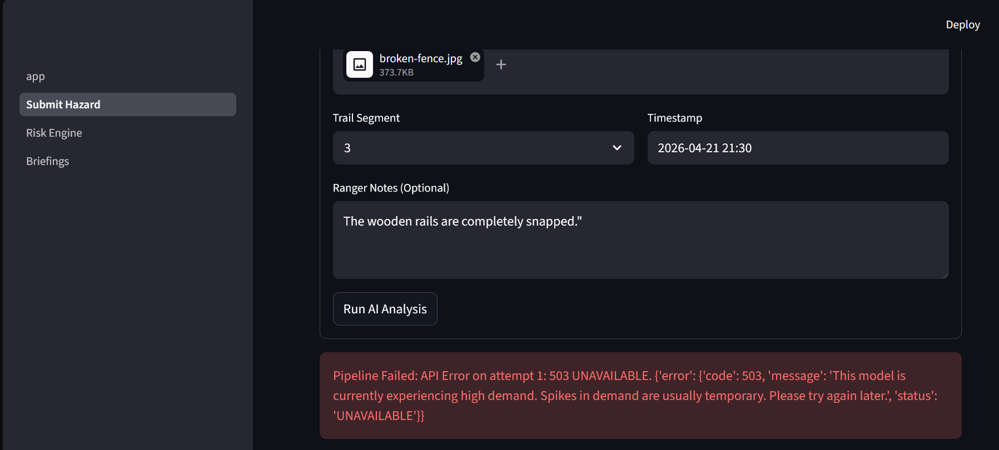
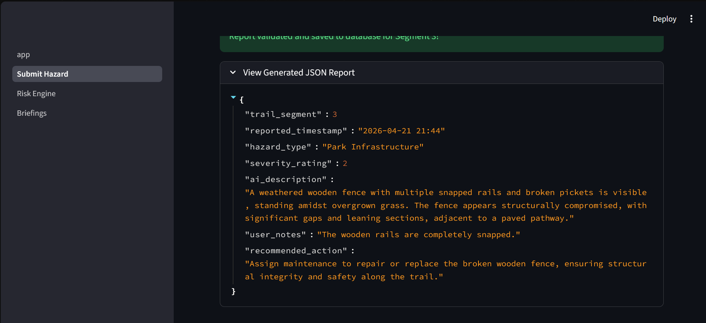
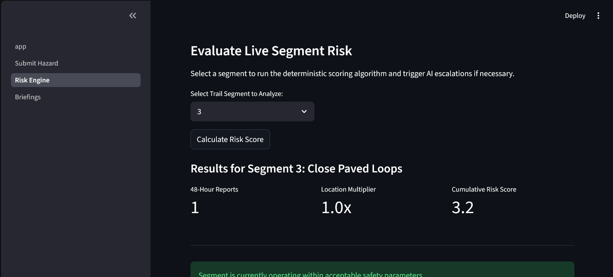
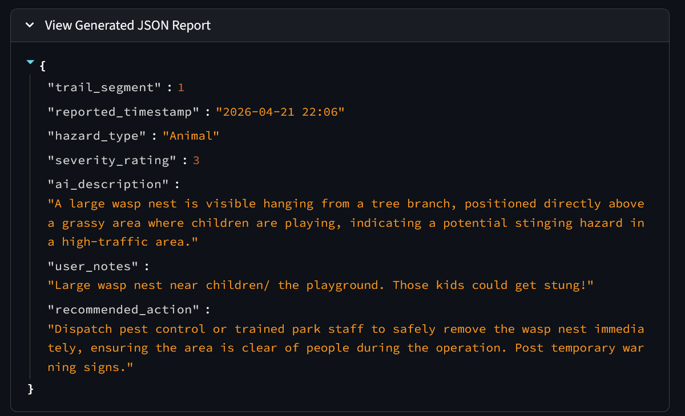
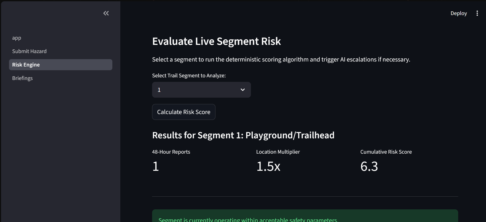
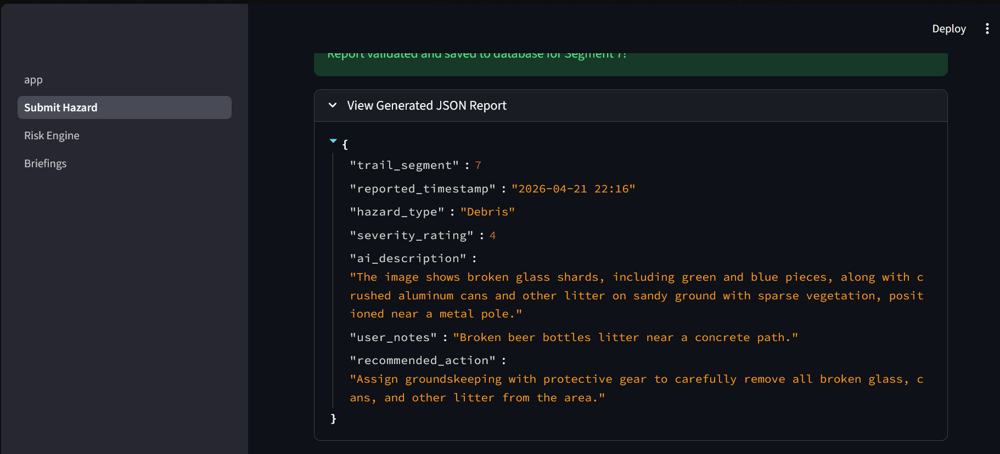
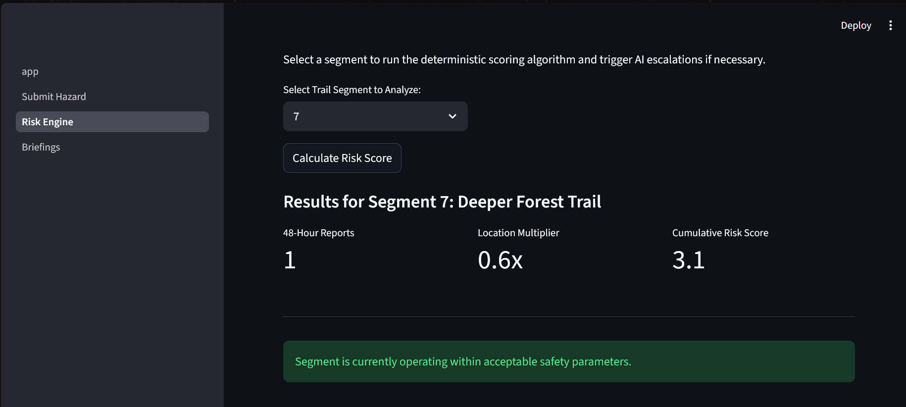
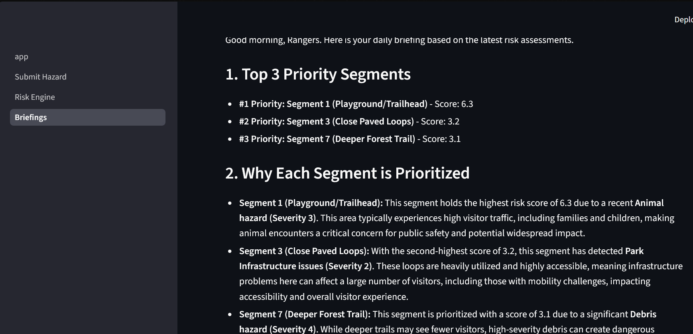

### Smoke Test Results

Here, code 503 is generated, indicitating high traffic/usage of gemini vision API:

This is the result of a succesful run of broken-fence.jpg in segment 3, producing a validated JSON formatted report. The cumulative risk score is a result of the risk formula and
the severity rating of reports to segment 3

Here's the report for an image of a large wasp nest by segment 1. The location multiplier is higher than other segments due to the high traffic, resulting in a higher cumulative risk score.

Here's the report for an image of some broken beer bottles and litter by segment 7, a farther and less hiked through park segment. Admittedly, the severity rating is rather high for some bright and easily avoided litter, and adding built sample to analysis.py would fix this. The location multiplier is lower than other because not many hikers and parkgoers pass by here.

Here's a snippet of ranger briefing running, and producing accurate assessment of recently submitted segments from this smoke test.

